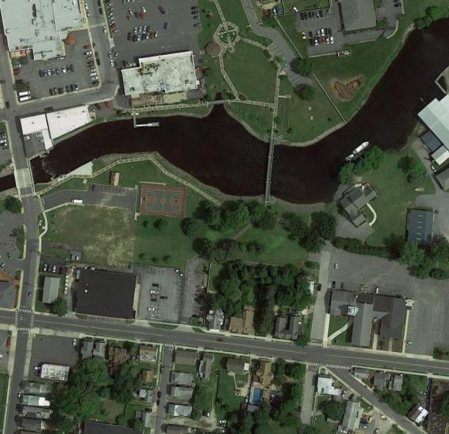
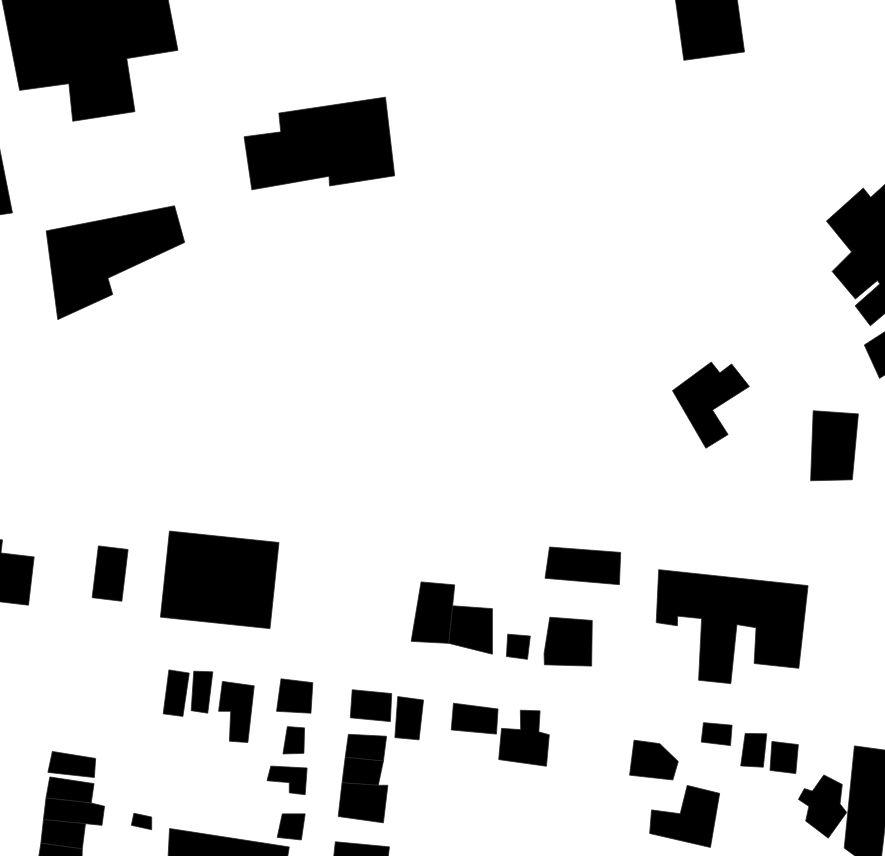

# market-detection
This repository contains code examples from the paper: *Satellite-Based Food Market Detection for Micronutrient Deficiency Prediction.*

## Abstract
Micronutrient deficiency (MND) is a nutritional disorder caused by a lack of essential vitamins and minerals, often leading to severe physical and mental developmental impairment. MND is highly prevalent worldwide, particularly in South Asia, South America, and sub-Saharan Africa, and affects an estimated 2 billion people. Public health research in MND indicates that food markets are often correlated with improved dietary diversity, a proxy for MND prediction. However, data on market locations is limited, particularly in rural areas where MND is most common. We propose an approach to automatically detect regional food markets from publicly available geographic infrastructure data and satellite imagery, which may be used towards developing a cost-effective, noninvasive MND prediction model.

## Usage
This repository contains two main Python Notebooks. *map-download* contains an example of downloading images from the Google Maps Static API. An API key is needed to run this code, which can be obtained from the Maps Static API [website](https://developers.google.com/maps/documentation/maps-static/overview).

*model-training* contains sample code that may be used to train the segmentation model. To use this code, direct filepath constants to local repository of images and masks in .png format, which will be used to train a segmentation algorithm. Note that augmentation is done within the code example, and does not have to be done ahead of time. 

## Resource Examples 
The folder *building-shapefiles* contains an example of the building blueprints available from OSM. This data in particular was downloaded from [Geofabrik Downloads](http://download.geofabrik.de/north-america.html), which was also used to download the Madagascar data. A sample region in Delaware is chosen for example. Additionally, *training-exs* contains examples of satellite image outputs and masks that may be used for segmentation model training.
